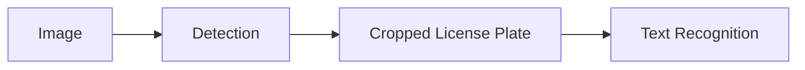
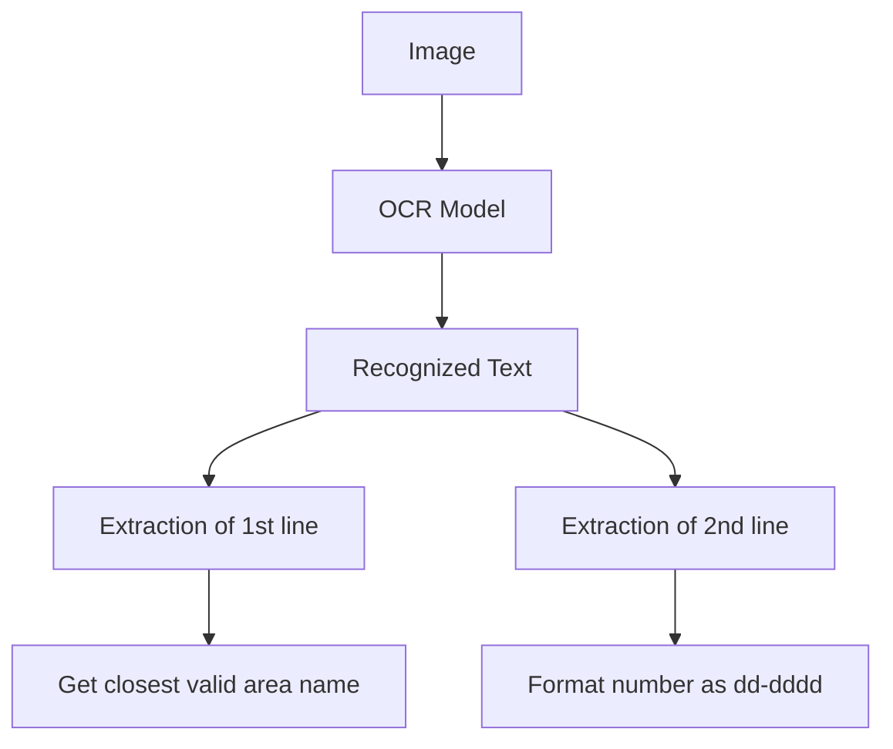
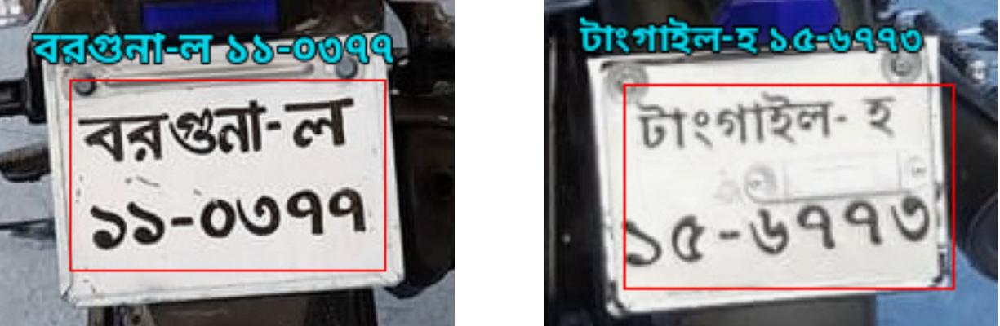
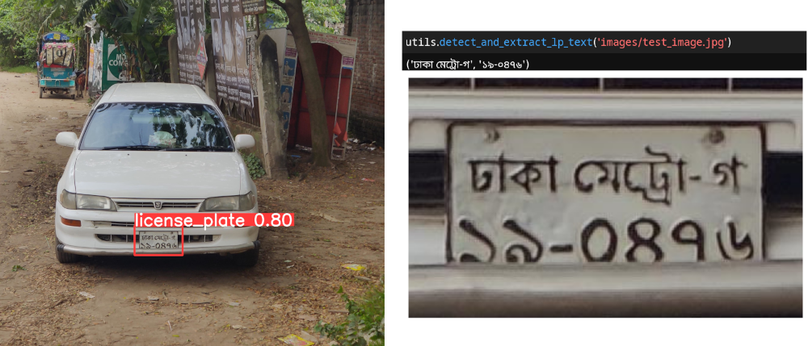

## Introduction

This project aims to create a pipeline that recognizes license plates of vehicles in bangladesh. LPR is a two step process. The first is to detect the region of an image where the license plate is present and then perform ocr to extract the text. This is a simplified overview of the pipeline



### Detection

yolov8 is used for detection of the license plate. yolo can already detect license plates but it can be fine tuned on a particular dataset as well. `models/yolo.pt` is the model fine tuned on some images of vehicles containing bangla license plates.

### Recognition

[EasyOCR](https://github.com/JaidedAI/EasyOCR) library is used for the text recognition part. They already have a model for recognizing bengali characters. The model used by EasyOCR can also be fine tuned using this [repository](https://github.com/clovaai/deep-text-recognition-benchmark). The model in `models/EasyOCR/models` is the fine tuned version of the pretrained bengali model on a custom dataset.

## Text Extraction

License plates found in vehicles in bangladesh has two lines in it. The first line contains the area name and the vehicle class and the second lines contains a 6 digit number in the format `dd-dddd`. The number of possible area names are finite, so a list of all possible area names is used to correct minor mistakes made by the ocr model. This is done by using pythons difflib library which has the `get_close_matches` method. This method returns the string in the list that is the closest to the input string.



<figure>

<figcaption>Example of character recognition from cropped license plate</figcaption>
</figure>

## Usage

Convenient utility functions are provided to execute the full pipeline of detection and recognition.

For this to work, you need to have all the dependencies installed.

First create a virtual environment.

```sh
python -m venv ./
```

Then install the dependencies.

```sh
pip install -r requirements.txt
```

Download and extract the model files

```sh
gdown 1ujSYC3tEC3VNoxqUIWO2PG7Lg5HAdYqn
unzip models.zip
```

Now test with the demo image.

```python
import utils
utils.detect_and_extract_lp_text('images/test_image.jpg')
```

<figure>

<figcaption>Example of using the full pipeline</figcaption>
</figure>

The code was tested with Python 3.11.5.

## Training The Recognition Model

You can train the recognition model either from scratch or fine tune it. The code for training is in this [repository](https://github.com/clovaai/deep-text-recognition-benchmark). You can follow this [discussion](https://github.com/clovaai/deep-text-recognition-benchmark/issues/85) and configure the parameters accordingly.

After creating your dataset, you can start fine tuning with by calling the `train.py` script.

```sh
python train.py --batch_size 16 --num_iter 1500 --valInterval 50 --FT --saved_model='bengali.pth' --workers 2 --Transformation 'TPS' --FeatureExtraction 'ResNet'
```

The saved_model argument specifies the model that you want to fine tune. In this case it's this [bengali model](https://github.com/JaidedAI/EasyOCR/releases/download/v1.1.8/bengali.zip). The model in `models/EasyOCR/models/bn_license_tps.pth` is the result of fine tuning that pretrained model on this [dataset](https://drive.google.com/file/d/1JkqEEATN3uiaARQKrGEFFNidjBQpbCV5). Here are the results of experimenting with different hyper parameters.

| Transformation | Batch size | Similarity Measure (%) |
| -------------- | ---------- | ---------------------- |
| TPS            | 16         | 94.91                  |
| TPS            | 32         | 91.64                  |
| TPS            | 64         | 91.37                  |
| None           | 10         | 91.86                  |
| None           | 64         | 90.78                  |
| None           | 192        | 90.08                  |

The similarity measure is calculated using difflib.SequenceMatcher class which has a ratio method. This method returns a floating point number in the range [0, 1] indicating how similar two strings are. It produces almost the same result when compared to levenshtein distance also known as edit distance. These experiments were done using google colab.


## Real Time License Plate Recognition

This a work in progress. There are some issues with using compatible font for bengali. This output was obtained from running yolo detection in google colab and modifying the annotation portion of the detection code.

https://github.com/renzhamin/bengali-alpr/assets/57265942/15797366-87d4-4e92-bd89-aa057a5fbd74
